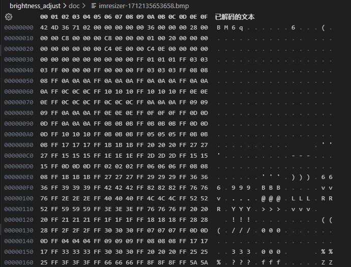
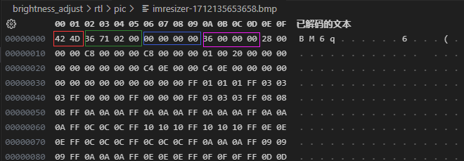
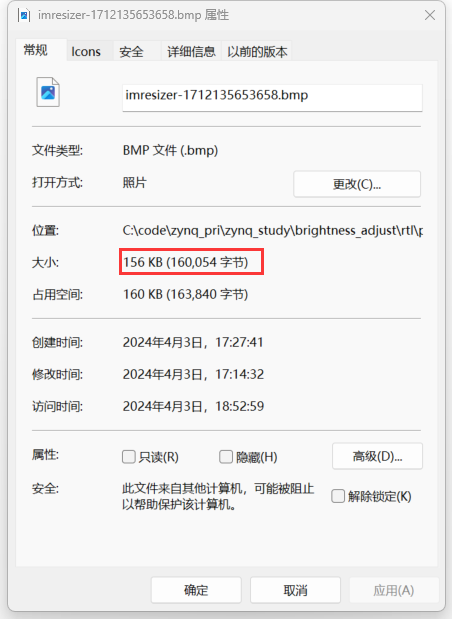
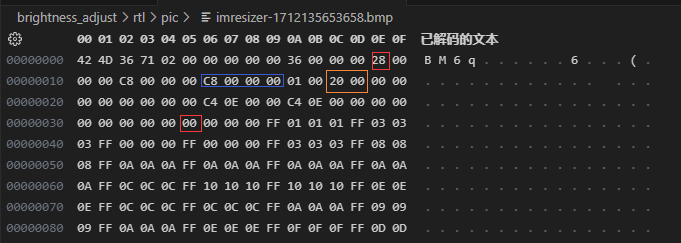
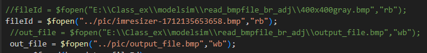
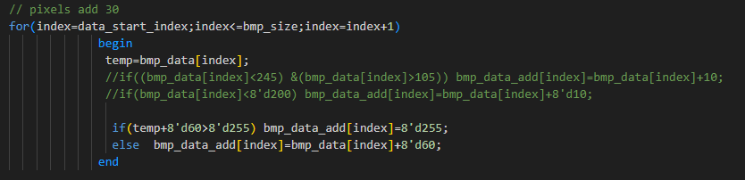
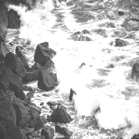

第八次作业

2023E8019482015 姚江瑜

### 1.1 生成一个200x200的灰度图，分析灰度图的数据格式（各部分的起始地址、大小、各字段的意义等）

200x200的灰度图如下：  

    

通过十六进制查看可以得到该灰度图的数据如下：

 **从上图可以看出，灰度图的文件头数据分析如下：**

很明显，文件头的前两个字节是文件类型 “BM” ；接下来4个字节是文件大小，0x027136=**160054**；然后4个字节是保留字段，全为0；最后4个字节是偏移量0x36，也就是说从**0x00 00 00 36开始为图像数据**。

  

**接下来是信息头数据，分析如下：**

信息头的前4个字节是信息头的大小，0x28=**40**；接下来4个字节是图像的宽度，0x00C8=**200**；再接下来4个字节是图像的高度，0x00C8=**200**，也说明了该图像存储是从下到上；然后是颜色平面数，0x01=**1**；接下来是每个像素的位数，0x0020=**32**；最后是压缩方式，0x00=**0**，说明没有压缩。

32位图像数据，不需要调色板数据，每个像素占4个字节，分别是B、G、R、A，所以每个像素的数据是4个字节，也就是32位。所以，200x200的图像数据大小是200x200x4=**160000**字节，加上文件头和信息头的大小，总共是**160054**字节，与文件大小一致。

### 1.2 对200x200的灰度图进行亮度调节

**亮度调节的原理：**

通过改变仿真输入文件，将200x200文件输入到模块中，模块对输入的灰度图进行亮度调节，然后将调节后的图像输出到仿真输出文件中。将b改为b+60，即将每个像素点值都加60，这样就可以实现亮度调节。

对200x200的灰度图进行亮度调节，调节后的图像如下：

    
    
   

 从上图可以看出，左边是原始的200x200的灰度图，右边是亮度调节后的200x200的灰度图。

很明显，调节后的图像亮度更高，整体变亮了.
