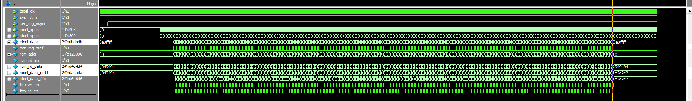
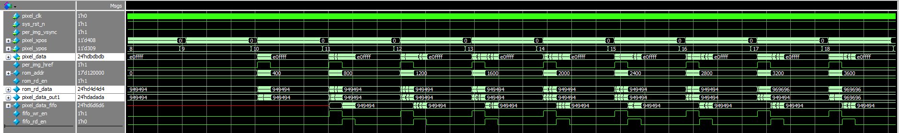
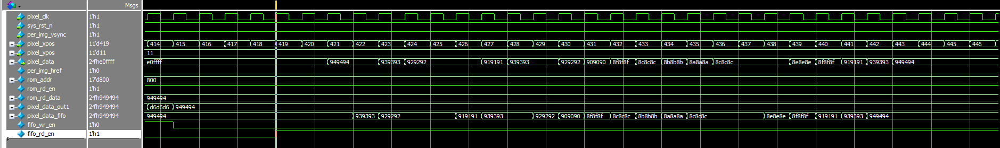
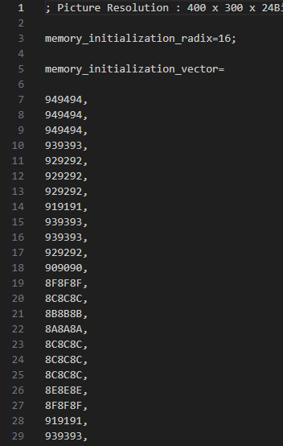
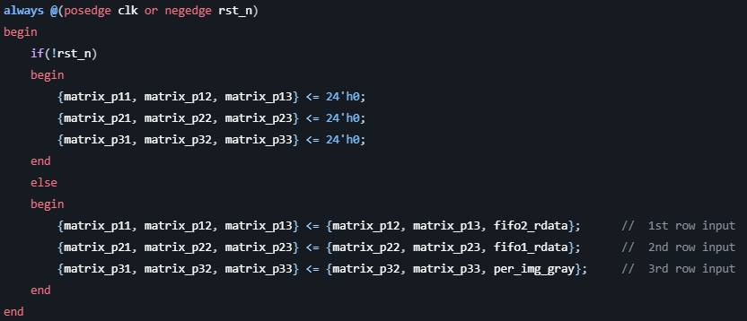
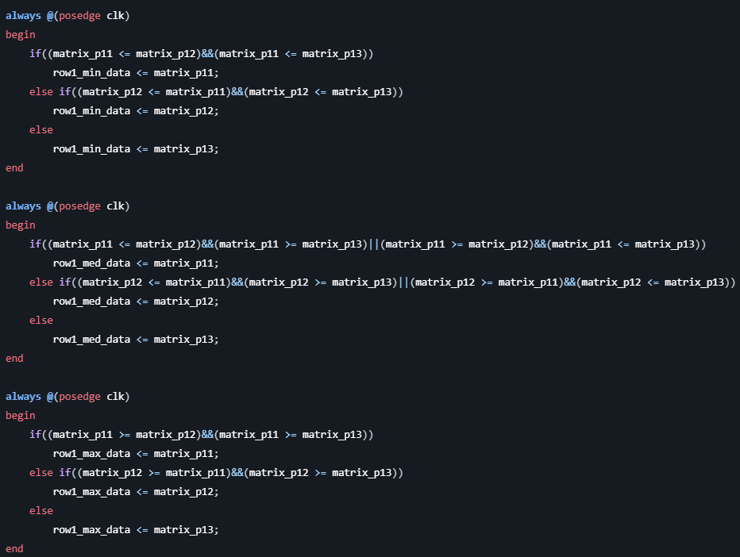
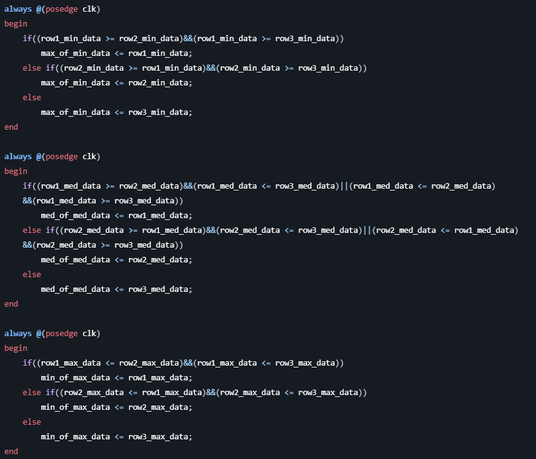
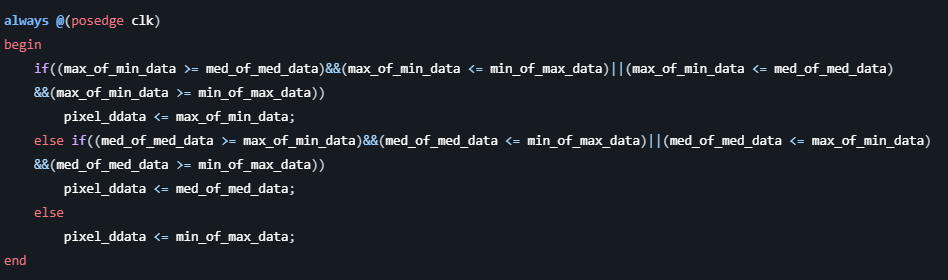
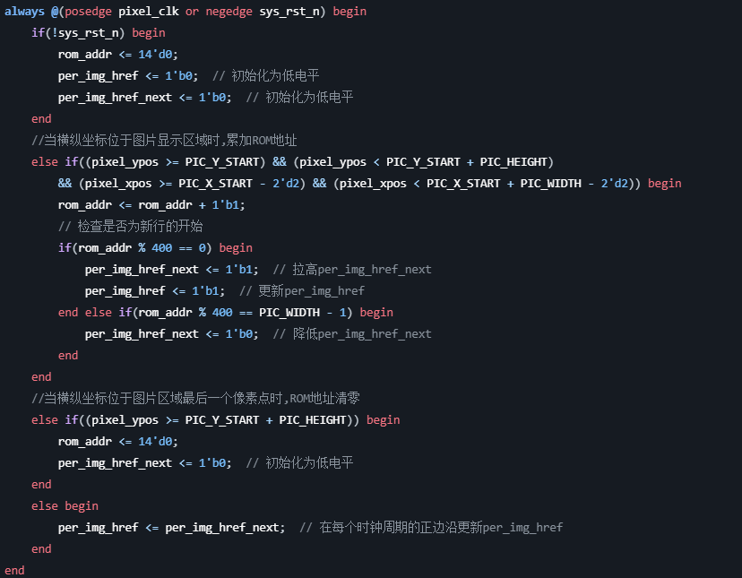
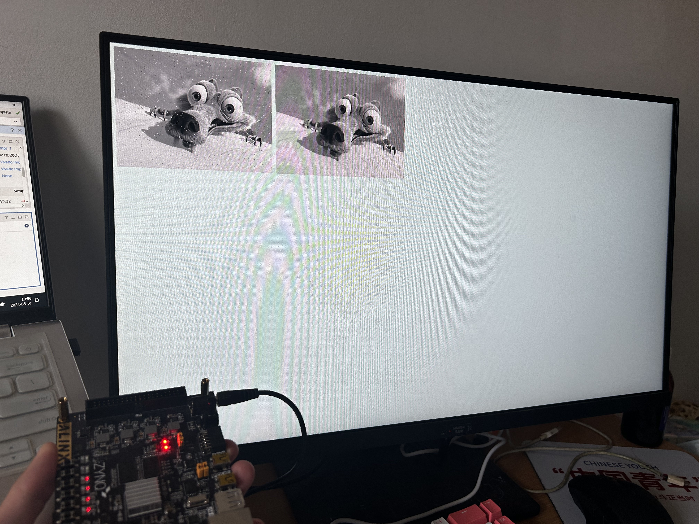

第十次作业

2023E8019482015 姚江瑜

###  完成一副图像的中值滤波

400x300的原始灰度图如下：  

    

我们可以看到，原始图像中有很多椒盐噪声，为了去除这些噪声，我们可以使用中值滤波。

**中值滤波的原理：**

中值滤波的基本思想是用像素点邻域灰度值的中值来代替该像素点的灰度值，让周围的像素值来决定该点的值，而不是用平均值来代替。中值滤波的优点是能有效的消除脉冲噪声，对保持图像边缘细节有很好的保护作用。

**中值滤波的步骤：**

1. 选择模板大小，一般选择3x3、5x5、7x7等。
采用3x3的模板，可以采用 **移位寄存器的ip核** 进行处理,也可以利用 **两个FIFO** 进行处理。
1. 将模板中的像素点按照灰度值大小进行排序。
排序采用 **并行3步中值法** ，即将3个像素点进行比较，将最大的放在最后，最小的放在最前，中间的放在中间。采用流水线的方式，可以加快处理速度，提高效率。注意一点，**判断3*3窗口是否到达边界，如果到达边界，直接将中心像素点的值赋给输出像素点。** 详解每步流程如下：
    1. 将每行的3个像素点进行两两比较，得到最大值max和最小值min以及中间值mid。
    2. 求3个最大值中的最小值a、3个最小值中的最大值b、3个中间值中的中间值c。
    3. 比较a、b、c，得到中间值，即为最终结果。
1. 取中值作为该像素点的灰度值。
2. 重复2、3步骤，直到所有像素点都处理完。
3. 输出处理后的图像。
采用HDMI显示，输出图像格式为RGB888格式，采用xilinx的zynq7020开发板，使用Vivado进行开发。

**中值滤波的仿真：**

整体仿真图如上所示，仿真结果中的rom_rd_data是原图信息，pixel_data_out1是中值滤波后的图像信息。pixel_data是在显示器中显示的像素点的灰度值，包含了rom_rd_data和pixel_data_out1。

中值滤波后的第一行信息如下：

可以看到，中值滤波后的第一行信息与matlab中的中值滤波结果一致：

**中值滤波的实现：**

3*3窗口的主要实现代码如下：

并行3步中值
排序的主要实现代码如下：（以第一行为例）

求每行的最大值、最小值、中间值的主要实现代码如下：

最后，根据中值滤波的原理，将最大值、中间值、最小值中的中间值作为输出像素点的灰度值：

显示器显示的一小部分关键代码如下：

**中值滤波的结果：**

中值滤波后的图像如上所示，可以看到，中值滤波后的图像中的椒盐噪声已经被去除，图像变得更加清晰。（左边为原图，右边为中值滤波后的图像）